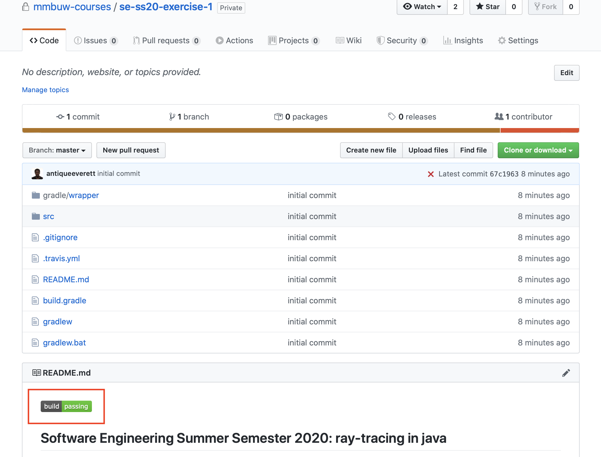
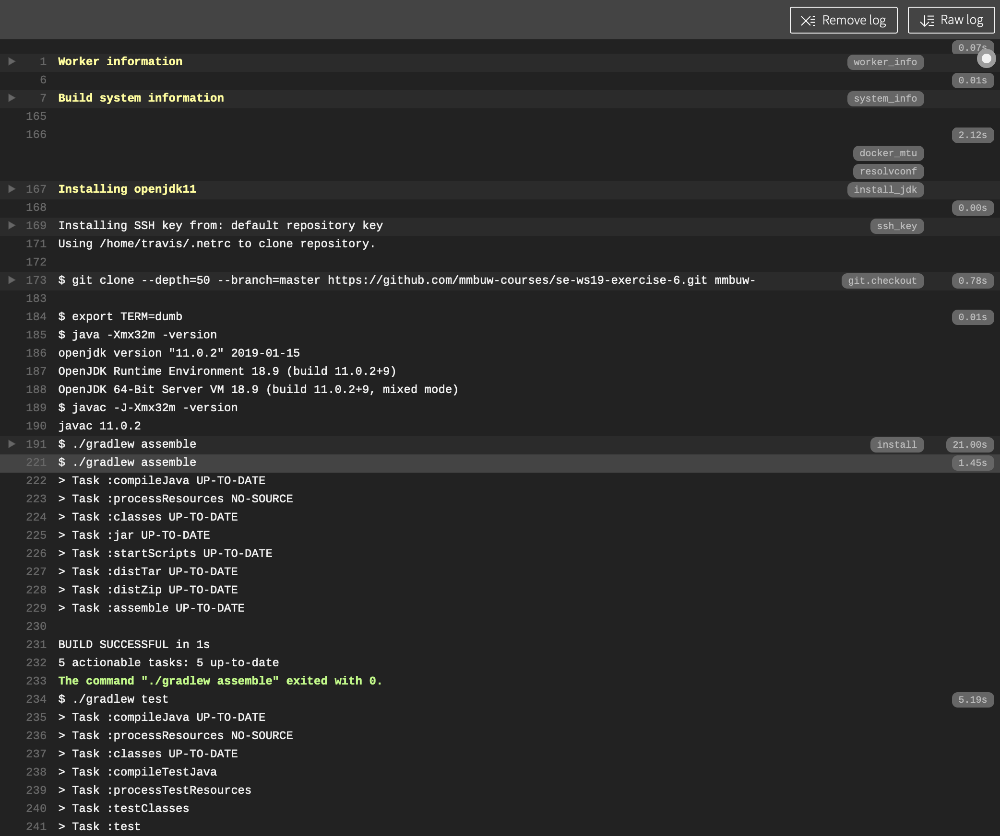

[](https://travis-ci.com/mmbuw-courses/se-sose20-exercise-2)

# Software Engineering Summer Semester 2020

- [ General Information ](#general-information)
- [ Getting Started ](#getting-started)
  - [ Prerequisites ](#prerequisites)
  - [ Building the project ](#running-testing-and-generating-evaluation-reports)
- [ Continuous integration: ](#continuous-integration)
  - [ Working with Travis ](#working-with-travis)
  - [ Updating the starter code ](#updating-the-exercise-starter-code-----important)
- [ Exercise resources ](#exercise-resources)

## General Information

This [ray tracing](https://en.wikipedia.org/wiki/Ray_tracing_(graphics)) exercise is a practical approach to learning and practicing foundational java language aspects.

We will use [ Test Driven Development ](https://en.wikipedia.org/wiki/Test-driven_development) ([ TDD ](https://en.wikipedia.org/wiki/Test-driven_development))
to complete each assignment.
Therefore, each exercise comes with starter code and ***FAILING*** test cases as a guideline.
The aim here, is to implement code such that the tests will ***PASS***.
As such, each exercise is scored based on ***PASSING TESTS***.


The tests cases are open to improvement, iff there is no mutation of the intended test behaviour.
However as a general note, we recommend using the test cases as they are without introducing any modifications.


Please note, throughout the completion and submission of theses exercises,
any academic dishonesty and breach of ethics will incur penalty.

[Plagiarism](https://en.wikipedia.org/wiki/Plagiarism#cite_note-RandomHouse95-1) is the representation of another
author's language, thoughts, ideas, or expressions as one's own.

## Getting started

### Prerequisites
[JDK11](https://jdk.java.net/11/)

[Gradle](https://gradle.org/install/) 

Installation of Gradle is optional. Gradle wrapper `gradlew` is provided as part of the project in the project root directory. 

### Project Structure
```bash
se-sose20-exercise-1
├── gradle
│   └── wrapper
├── out
│   ├── MainTest.md
│   ├── PrettyPrintParserTest.md
│   └── XMLParserTest.md
├── resources
|   ├── images
|   |   └── *.png
|   ├── foo.xml
|   ├── scene.x3d
|   ├── test1.x3d
|   ├── test2.x3d
|   └── test3.x3d
├── src
|   ├── main
|   |   └── java
|   |       ├── raytracer -> Here is space for your implementation
|   |       |   └── Main.java
|   |       └── score.java
|   └── test
|       └── java
|           └── raytracer
|               ├── MainTest.java
|               ├── PrettyPrintParserTest.java
|               └── XMLParserTest.java
├── .classpath
├── .gitignore
├── .project
├── build.gradle
├── settings.gradle
└── README.md
```
All exercise resources are available in the `./resources directory`.

### Building the project
On macOS, Linux, or the GitBash (for Windows)
```
./gradlew build
```
In the Windows Powershell:
```
gradlew.bat build
```
**n.b.**: These commands will not work without the JDK 11 prerequisite!

<a name="who"></a>
## Continuous integration
Continuous Integration or [CI](https://codeship.com/continuous-integration-essentials)
is a development practice where developers integrate code into a shared repository frequently,
preferably several times a day.
CI does not get rid of bugs, but however,
it does make them dramatically easier to find and remove!

As the main goal is to build a simple ray tracer using successive exercises,
it is **imperative** to always have a solution for the previous exercise.
For this reason,
each new exercise will be presented with a sample solution for the previous exercise.

Simply put;

Exercise 1 (no sample solution needed)

Exercise 2 (presented with Exercise 1 sample solution)

Exercise 3 (presented with Exercise 1 & 2 sample solutions)

Exercise 4 (presented with Exercise 1 & 2 & 3 sample solutions)

... *and so on*

Please note, it is not mandatory to use the sample solutions, in fact, its is highly recommended and encouraged to use your own solutions!

### Working with Travis
We will use the Travis CI for building and testing on Github

The [build status](https://travis-ci.com/mmbuw-courses/se-ws19-exercise-6.svg?token=vuni5zSQUmyYTd2SHV6a&branch=master)
badge (highlighted in red below) provides a visual indication of the current build, and whether or not it is currently passing.

`n.b.`

checking the build status here is an unnecessary formality iff local tests have been run and found to pass successfully.



If the build is failing, click on the badge to get a detailed report of why the current build fails.




### Updating the Exercise starter code ( <-- IMPORTANT)
The exercise starter code may be updated after it has been released ( i.e., for bug fixes, clarification, comments, hints, etc.).

In this particular case, it is necessary to merge the latest starter code update to ensure you have the current exercise starter code,

To do this, simply add the exercise repository as a remote:

```
git remote add upstream git@github.com:mmbuw-courses/se-sose20-exercise-$NUMBER.git
```
Where $NUMBER corresponds to the Exercise number. E.g.,

for Exercise 1:
```
git remote add upstream git@github.com:mmbuw-courses/se-sose20-exercise-1.git
```
for Exercise 2:
```
git remote add upstream git@github.com:mmbuw-courses/se-sose20-exercise-2.git
```
**P.S., this need only be done once per exercise repository!**

Once done, update

```
git pull upstream master
```
Resolving merge conflicts is inevitable and this is the perfect opportunity to get accustomed to developing an approach to merging.
